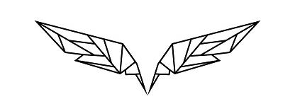

<p align="center">
    
</p>

# Wingman

Wingman is a Python library built for managing projects in deep learning.
Currently, Wingman is capable of automatically handling:
- Automatic weights saving and versioning
- Smooth WanbB integration
- Building blocks for popular torch modules
- Smoothly handling commandline arguments and `*.yaml` config files

## Installation

`pip3 install jj-wingman`

> Wingman does not come with a PyTorch requirement by default, so all torch-functionality is by default disabled.
> If you wish to use the PyTorch functionality of Wingman, install a compatible Pytorch version for your machine.
> This is typically done via:
> `pip3 install torch`

## Philosophy

Wingman is designed to be very horizontally integrated into your deep learning projects.
Instead of wrapping your models with wrappers or designing your models around Wingman, Wingman adapts to your projects, and you are the decider on when and where Wingman comes into play.

## Modules

Wingman has several core modules and static functions, all of which can be used independently or in conjunction.


<br>

### `from wingman import Wingman`

This is the core module for Wingman, Wingman requires a bare minimum `config.yaml` file somewhere accessible in your project directory, this can be generated by running `wingman-generate-yaml [optional filename]` on the commandline.
A bare minimum yaml file is as follows:

```yaml
# wingman required params
debug: false

weights_directory: 'weights'
version_number: null
mark_number: 0
log_status: false

increment: true
logging_interval: 10
max_skips: 5
greater_than: 0.0

wandb: false
wandb_name: ''
wandb_notes: ''
wandb_id: ''
wandb_entity: 'jjshoots'
wandb_project: 'my_new_project'
```

The parameters described are as follows:
- `debug`: Whether to set the model to debug mode
- `weights_directory`: Where should Wingman point to for model weight saving
- `version_number`: Wingman versions different models using this number, if this is left as null, Wingman automatically chooses a number.
- `mark_number`: Wingman checkpoints models using this number if left at 0, automatic checkpoint numbering occurs if the `increment` parameter is set to true.
- `log_status`: Whether to save a `.txt` log file of Wingman's outputs.
- `increment`: Whether to increment mark number, if this is set to false, Wingman won't save multiple variations of the same model.
- `logging_interval`: During training, pass the training step to wingman, and after `logging_interval` steps has passed, Wingman will record the training. If Wingman has found a new lowest point, the model weights will be saved to a new file.
- `max_skips`: How many logging steps skipped without finding a new lowest point (specified using the `logging_interval` argument) before Wingman will save an intermediary checkpoint of the model.
- `greater_than`: You can tell Wingman to only checkpoint the model when the previous checkpointed loss is more than the current loss by this value.
- `wandb`: Whether to log things to WandB.
- `wandb_name`: The name of the run to be displayed in WandB. If left blank, Wingman automatically assigns one depending on the model version number.
- `wandb_notes`: Some helpful notes that you can leave for your runs that will be recorded in WandB.
- `wandb_id`: A Unique ID for this run. If left blank, one is automatically assigned.
- `wandb_entity`: Your username/organization name for WandB.
- `wandb_project`: The project that this run will be under.

If you need more parameters, adding them to the `config.yaml` file can be done freely, and these parameters can be easily referenced in the code later.
In addition, Wingman also automatically generates a `device` parameter, this parameter is automatically set to the GPU if your system has one, and can be used later for easy transfer of tensors.

You can also use the `config.yaml` file to define a set of sane defaults, and then override them using commandline arguments later.
This is because Wingman automatically converts all parameters in the `config.yaml` file into commandline arguments using the `argparse` python module.
This allows your `main.py` file to be much cleaner, without requiring the 50 odd lines of code at the top only for parameter definition.
For instance, if you have `hack_level=10.3` in the `config.yaml`, you can override its value via the commandline argument by doing `python3 your_program.py --hack_level=69.420`.

After defining your `config.yaml` file, the basic usage of Wingman is as follows:

```python
    from wingman import Wingman

    # initialize Wingman and get all the parameters from the `config.yaml` file
    wm = Wingman("./config.yaml")
    cfg = wm.cfg

    # load the model and optimizer, `cfg.device` is automatically generated
    model = Model(cfg.YOUR_PARAM, cfg.YOUR_OTHER_PARAM).to(cfg.device)
    optim = optimizer.AdamW(model.parameters(), lr=cfg.YOUR_LEARNING_RATE_PARAM, amsgrad=True)

    # we can check if we have trained this model before, and if we have, just load it
    # this checking is done using the `version_number` param, if `latest=True` is set,
    # Wingman automatically searches for the latest model checkpoint,
    # otherwise, Wingman uses the checkpoint specified by `mark_number`
    have_file, weight_file, optim_file = wm.get_weight_files(latest=True)
    if have_file:
        # Wingman simply returns a string of where the weight files are
        # no unnecessary wrapping!
        model.load_state_dict(torch.load(model_file))
        optim.load_state_dict(torch.load(optim_file))

    # let's run some training:
    while(training):
        ...
        # training code here
        loss = YOUR_LOSS_FUNCTION(model)
        ...

        # when wandb is enabled (via `wandb = true` in the yaml file)
        # logging can be done by passing Wingman a dictionary
        # the dictionary is logged to wandb every logging interval
        wm.log = {"log": 5, "these": 2.34, "values": -5.432}

        # ... or you can force wandb logging using
        wm.wandb_log()

        # let Wingman handle checkpointing for you
        update_weights, model_file, optim_file = wm.checkpoint(loss, training_step)
        if update_weights:
            # if Wingman deems that the weights should be checkpointed, it returns
            # a string of where the weight files should go for it to be found later
            torch.save(model.state_dict(), model_file)
            torch.save(optim.state_dict(), optim_file)
```
#### Weights Directory Compression

If you train a lot of models, the weights directory can start to use a lot of disk space.
Running `wingman-compress-weights [optional directory name]` on the commandline will remove all redundant mark numbers and delete all empty files.


<br>

### `from wingman import NeuralBlocks`

Neural blocks is a module for quickly prototyping neural network architectures.
It offers several easier methods of defining standardized modules:

#### Simple 3-layer MLP with ReLU activation
```python
>>> from wingman import NeuralBlocks
>>> features = [4, 16, 64, 3]
>>> activation = ["relu", "tanh", "identity"]
>>> norm = "batch"
>>> bias = True
>>> MLP = NeuralBlocks.generate_linear_stack(features, activation, norm, bias)
>>> print(MLP)

Sequential(
  (0): Sequential(
    (0): BatchNorm1d(4, eps=1e-05, momentum=0.1, affine=True, track_running_stats=True)
    (1): Linear(in_features=4, out_features=16, bias=True)
    (2): ReLU()
  )
  (1): Sequential(
    (0): BatchNorm1d(16, eps=1e-05, momentum=0.1, affine=True, track_running_stats=True)
    (1): Linear(in_features=16, out_features=64, bias=True)
    (2): Tanh()
  )
  (2): Sequential(
    (0): BatchNorm1d(64, eps=1e-05, momentum=0.1, affine=True, track_running_stats=True)
    (1): Linear(in_features=64, out_features=3, bias=True)
    (2): Identity()
  )
)
```

#### 4 layer convolutional network with same padding and MaxPool2d across the last two layers
```python
>>> from wingman import NeuralBlocks
>>> channels = [3, 16, 32, 64, 1]
>>> kernels = [3, 1, 3, 1]
>>> pooling = [0, 0, 2, 2]
>>> activation = ["relu", "relu", "tanh", "tanh"]
>>> padding = None # this is equivalent to same padding
>>> norm = "batch"
>>> CNN = NeuralBlocks.generate_conv_stack(channels, kernels, pooling, activation, padding, norm)
>>> print(CNN)

Sequential(
  (0): Sequential(
    (0): BatchNorm2d(3, eps=1e-05, momentum=0.1, affine=True, track_running_stats=True)
    (1): Conv2d(3, 16, kernel_size=(3, 3), stride=(1, 1), padding=(1, 1))
    (2): ReLU()
  )
  (1): Sequential(
    (0): BatchNorm2d(16, eps=1e-05, momentum=0.1, affine=True, track_running_stats=True)
    (1): Conv2d(16, 32, kernel_size=(1, 1), stride=(1, 1))
    (2): ReLU()
  )
  (2): Sequential(
    (0): BatchNorm2d(32, eps=1e-05, momentum=0.1, affine=True, track_running_stats=True)
    (1): Conv2d(32, 64, kernel_size=(3, 3), stride=(1, 1), padding=(1, 1))
    (2): MaxPool2d(kernel_size=2, stride=2, padding=0, dilation=1, ceil_mode=False)
    (3): Tanh()
  )
  (3): Sequential(
    (0): BatchNorm2d(64, eps=1e-05, momentum=0.1, affine=True, track_running_stats=True)
    (1): Conv2d(64, 1, kernel_size=(1, 1), stride=(1, 1))
    (2): MaxPool2d(kernel_size=2, stride=2, padding=0, dilation=1, ceil_mode=False)
    (3): Tanh()
  )
)
```

#### 2 layer transposed convolutional network
```python
>>> from wingman import NeuralBlocks
>>> channels = [64, 32, 3]
>>> kernels = [4, 4]
>>> padding = [1, 1]
>>> stride = [2, 2]
>>> activation = ["lrelu", "lrelu"]
>>> norm = "non"
>>> TCNN = NeuralBlocks.generate_deconv_stack(channels, kernels, padding, stride, activation, norm)
>>> print(TCNN)

Sequential(
  (0): Sequential(
    (0): ConvTranspose2d(64, 32, kernel_size=(4, 4), stride=(2, 2), padding=(1, 1))
    (1): LeakyReLU(negative_slope=0.01)
  )
  (1): Sequential(
    (0): ConvTranspose2d(32, 3, kernel_size=(4, 4), stride=(2, 2), padding=(1, 1))
    (1): LeakyReLU(negative_slope=0.01)
  )
)
```

The Neural Blocks module also has functions that can generate single modules, refer to the file itself for more details.


<br>

### `from wingman import ReplayBuffer`

This is a replay buffer designed around Torch's Dataloader class for reinforcement learning projects.
This allows easy bootstrapping of the Dataloader's excellent shuffling and pre-batching capabilities.
In addition, all the data is stored as a numpy array in a contiguous block of memory, allowing very fast retrieval.
ReplayBuffer also doesn't put any limits on tuple length per transition; some people prefer to store $\{S, A, R, S'\}$, some prefer to store $\{S, A, R, S', A'\}$ - ReplayBuffer doesn't care!
The length of the tuple can be as long or as short as you want, as long as every tuple fed in is the same length and each element of the tuple is the same shape.
There is no need to predefine the shape of the inputs that you want to put in the ReplayBuffer, it automatically infers the shape and computes memory usage upon the first tuple stored.
The basic usage of the ReplayBuffer is as follows:

```python
import torch

from wingman import ReplayBuffer

# we define the replay buffer to be able to store 1000 tuples of information
memory = ReplayBuffer(mem_size=1000)

# get the first observation from the environment
next_obs = env.reset()

# iterate until the environment is complete
while env.done is False:
    # rollover the observation
    obs = next_obs

    # get an action from the policy
    act = policy(obs)

    # sample a new transition
    next_obs, rew, dne, next_lbl = env.step(act)

    # store stuff in the replay buffer
    memory.push((obs, act, rew, next_obs, dne))

# perform training using the buffer
dataloader = torch.utils.data.DataLoader(
    memory, batch_size=32, shuffle=True, drop_last=False
)

# easily treat the replay buffer as an iterable that we can iterate through
for batch_num, stuff in enumerate(dataloader):
    observations = gpuize(stuff[0], "cuda:0")
    actions = gpuize(stuff[1], "cuda:0")
    rewards = gpuize(stuff[2], "cuda:0")
    next_states = gpuize(stuff[3], "cuda:0")
    dones = gpuize(stuff[4], "cuda:0")
```


<br>

### `from wingman import gpuize, cpuize`

These are quality of life standalone functions.

```python
>>> import numpy as np
>>> from wingman import gpuize, cpuize
>>> foo = np.random.random((5, 5))
>>> print(foo)

[[0.28392764 0.50936983 0.55433616 0.45614518 0.82523046]
 [0.77437072 0.20900382 0.86220494 0.69071239 0.94863786]
 [0.70082865 0.92780018 0.98392965 0.76945165 0.72886401]
 [0.47702485 0.54968522 0.22110942 0.72436276 0.42574472]
 [0.78330221 0.84888837 0.68529167 0.61878902 0.13556213]]

>>> bar = gpuize(foo, "cuda:0")
>>> print(bar)

tensor([[0.2839, 0.5094, 0.5543, 0.4561, 0.8252],
        [0.7744, 0.2090, 0.8622, 0.6907, 0.9486],
        [0.7008, 0.9278, 0.9839, 0.7695, 0.7289],
        [0.4770, 0.5497, 0.2211, 0.7244, 0.4257],
        [0.7833, 0.8489, 0.6853, 0.6188, 0.1356]], device='cuda:0')

>>> baz = cpuize(bar)
>>> print(baz)

[[0.28392764 0.50936983 0.55433616 0.45614518 0.82523046]
 [0.77437072 0.20900382 0.86220494 0.69071239 0.94863786]
 [0.70082865 0.92780018 0.98392965 0.76945165 0.72886401]
 [0.47702485 0.54968522 0.22110942 0.72436276 0.42574472]
 [0.78330221 0.84888837 0.68529167 0.61878902 0.13556213]]
```

If used in conjunction with Wingman, it's possible to simply do `gpuize(foo, cfg.device)` when `cfg` is defined as done earlier.

****
****
> Why does every plane have two pilots?
> Really, you only need one pilot.
> Let's take out the second pilot.
> Let's let the bloody computer fly it.
